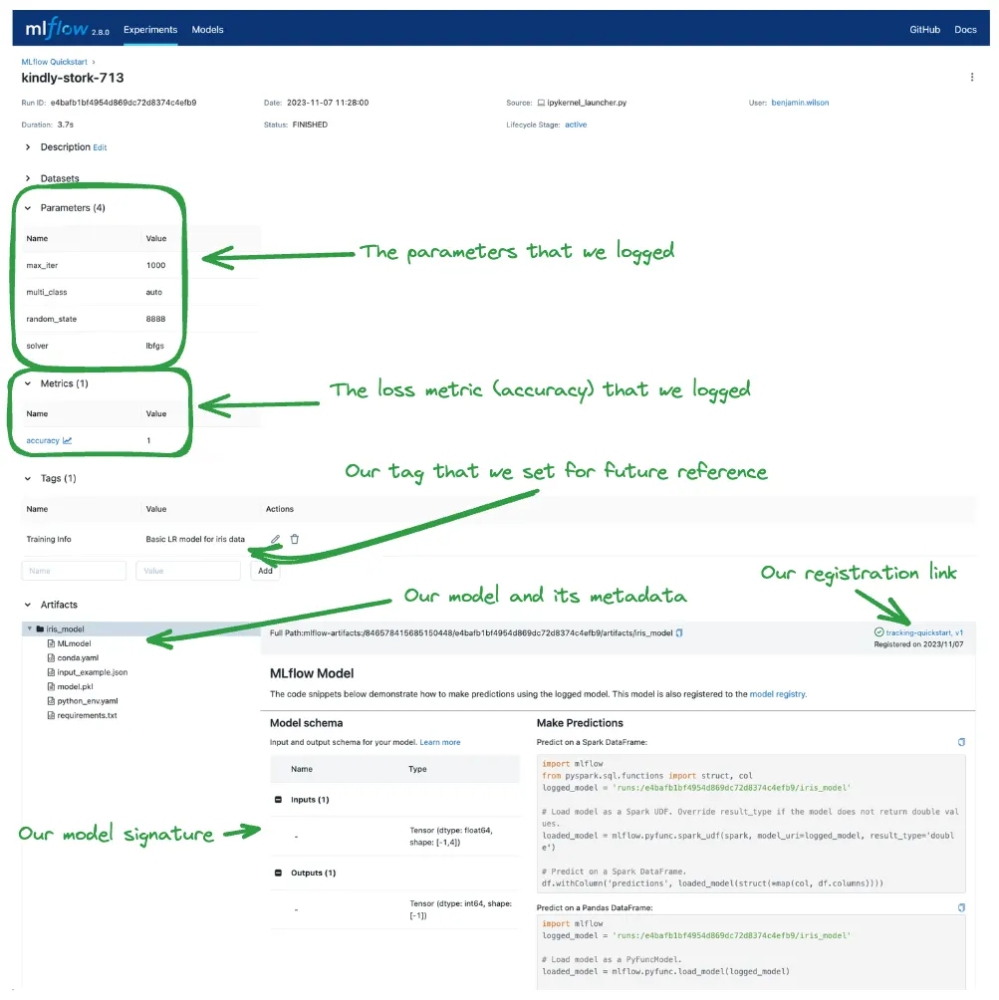

<p align="center">
  
</p>

MLflow is an **open-source platform** designed to manage the **end-to-end machine learning lifecycle**.  
It works seamlessly with popular ML libraries (Scikit-learn, XGBoost, TensorFlow, PyTorch) and supports multiple programming languages (Python, R, Java) via SDKs and REST API.

---

## 🔹 1. What is MLflow?

MLflow provides tools for:

- **Experiment Tracking** → log parameters, metrics, artifacts, and models.  
- **Model Registry** → register models with names and versions.  
- **Model Deployment** → load models by version/stage (`@staging`, `@champion`), serve via REST API.  
- **Flexibility** → works across ML libraries, frameworks, and environments.  

## 🔹 2. Why Use MLflow?

MLflow simplifies and automates ML workflows:

- ✅ Track & compare experiments  
- ✅ Save & version models  
- ✅ Reproduce and reuse trained models  
- ✅ Deploy models seamlessly for inference  
- ✅ Manage ML workflows across teams & infrastructure  

👉 In short: **MLflow bridges the gap between research and production.**

## 🔹 3. Frameworks Supported

MLflow supports logging and deployment for:

- Scikit-learn  
- XGBoost  
- LightGBM  
- TensorFlow & Keras  
- PyTorch  
- Spark MLlib  
- ONNX models  


## 🔹 4. Cloud & MLOps Integrations

MLflow integrates smoothly with:

- **AWS (S3, SageMaker)**  
- **Azure ML**  
- **GCP (Vertex AI, GCS)**  
- **Docker, Kubernetes, and REST APIs**  
- **CI/CD pipelines for MLOps**  


## 🔹 5. Sample Code Walkthrough

A quick walkthrough of **experiment tracking → model registry → deployment**:

### Step 1: Install MLflow & Launch UI
```bash
pip install mlflow
mlflow ui  # Runs on http://localhost:5000
```

### Step 2: Set Tracking URI & Create Experiment
```
import mlflow

mlflow.set_tracking_uri("http://<host>:<port>")
mlflow.set_experiment("experiment_name")
```

### Step 3: Log Parameters, Metrics & Models
```
with mlflow.start_run(run_name="model_name"):
    mlflow.log_params(params)
    mlflow.log_metric("accuracy", accuracy)
    mlflow.log_metrics({"recall_class_0": report_dict['0']['recall']})
    mlflow.sklearn.log_model(model, "sklearn_model")
```

### Step 4: Register the Model
```
model_name = "MyModel"
model_uri = f"runs:/{run_id}/model"
mlflow.register_model(model_uri=model_uri, model_name=model_name)
```

### Step 5: Load Model by Version
```
model_uri = f"models:/{model_name}/1"
loaded_model = mlflow.pyfunc.load_model(model_uri)
y_pred = loaded_model.predict(X_test)
```

### Step 6: Promote Model to Production
```
client = mlflow.MlflowClient()
client.copy_model_version("models:/MyModel@challenger", "ProductionModel")
```

### Step 7: Load Production Model
```
prod_model_uri = f"models:/MyModel@champion"
loaded_model = mlflow.pyfunc.load_model(prod_model_uri)
y_pred = loaded_model.predict(X_test)
```


## 6. MLflow Use Cases in Production

- Industry	Use Case
- E-commerce	Product recommendation systems, personalization models
- Finance	Fraud detection, credit scoring, risk management
- Healthcare	Disease prediction, diagnostic ML models
- Manufacturing	Predictive maintenance, defect detection
- Marketing	Customer segmentation, churn prediction


## 7. MLflow on AWS SageMaker

MLflow integrates with AWS SageMaker to manage experiments and deployments:
-	Track SageMaker experiments with MLflow tracking server
-	Store ML artifacts in Amazon S3
-	Deploy MLflow-trained models on SageMaker endpoints
-	Use mlflow.sagemaker.deploy() for deployment

Example Flow:
1.	Launch MLflow on EC2/EKS
2.	Set SageMaker as tracking/serving backend
3.	Deploy model with mlflow.sagemaker.deploy()

**Note**: AWS also provides SageMaker Experiments, but MLflow can be used as a plug-in for multi-cloud setups.

## Samples of my Experiments




## Summary

MLflow is a powerful end-to-end ML lifecycle manager that helps data scientists and ML engineers:

-	Track, reproduce, and compare experiments
-	Manage and version models centrally
-	Deploy models to production across platforms
-	Integrate with MLOps workflows in the cloud

👉 With MLflow, your ML projects can move from research → production seamlessly.

---
